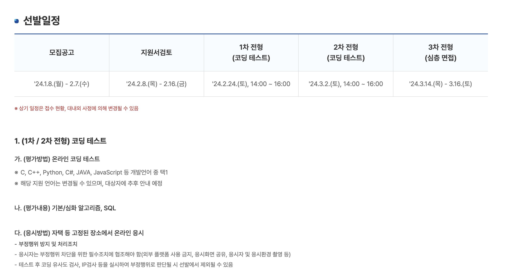
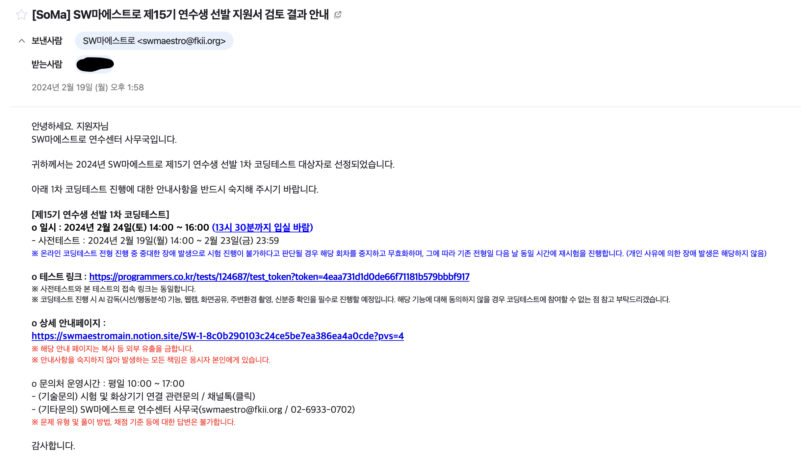
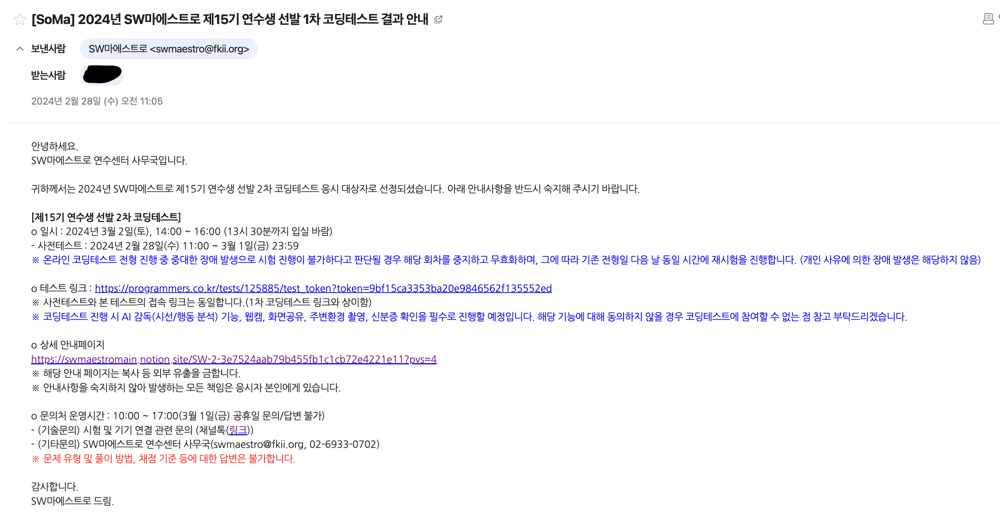
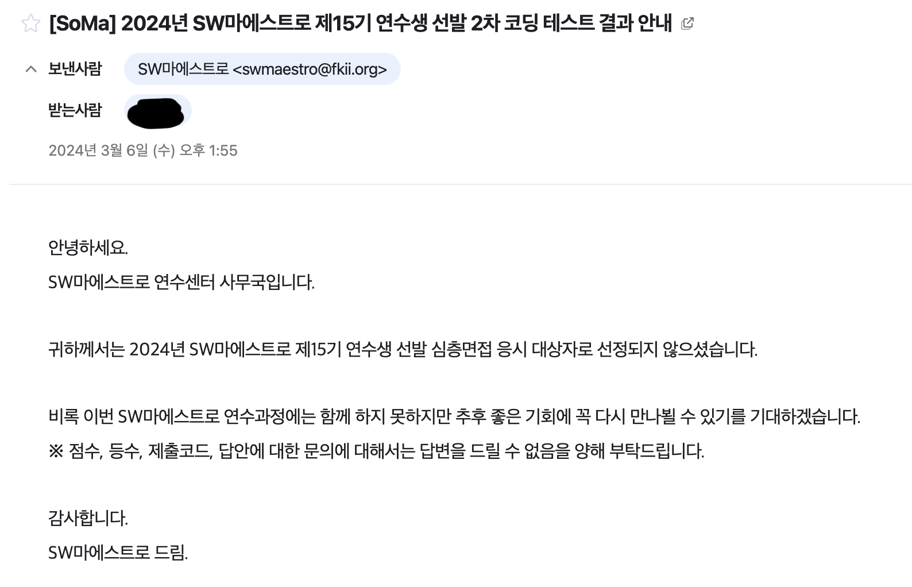

이번에 소프트웨어 마에스트로 15기를 지원했다.

SW마에스트로는 "창의도전형 프로젝트 기획 개발" 교육 과정을 운영하여, 프로젝트 성과가 우수한 연수생을 선발하여 글로벌 SW역량 강화 프로그램을 지원한다. 프로그램 과정 중에서 IT기기 지원, 매월 장학금 지원, 프로젝트 개발비 지원.. 등 연수생에게 전폭적인 지원이 나온다.
그렇기 때문에 개발자로 취업을 준비하는 사람들, 컴퓨터 공학과에 재학 중인 대학생들에게 인기가 많고 경쟁률이 되게 높은 프로그램이다.
 
현재 나는 컴퓨터 관련과 재학 중이며 스타트업에도 관심이 있고, 많은 지원을 받으며 잘하는 사람들과 함께 프로젝트를 진행하는 경험을 해보고 싶어 지원하게 되었다.
그리고 내 코딩테스트 실력이 어느 정도 일지 궁금했다. 실제 코딩테스트를 봐본 적이 한 번도 없어서 떨어지더라도 나에게 좋은 경험이 될 거라고 생각했다.

## 지원서 작성

처음엔 지원서를 제출해야 했다.
지원서의 질문은 총 두 가지였다.
 
<b>1. (*필수) [자기소개] SW분야의 전문성을 키우기 위해 몰입했던 경험과 도전이 무엇인지, 또한 이러한 성장과정을 통해 얻은 배움은 무엇인지를 서술하여 주시기 바랍니다.(최소 400자, 최대 1000자 입력가능)</b>

이 질문은 막연하게 어떤 언어를 배웠고, 어떤 프레임워크를 배웠고,... 와 같은 식으로 작성하면 별로 좋지 않을 것 같았다.
그래서 학교에서 개발에 관심 있는 친구들과 같이 앱 개발을 하고 배포까지 했던 경험을 중심으로 적었다. 당시 하던 프로젝트가 처음 해본 프로젝트였고 학교 학생들을 대상으로 한 앱이었다. 기술은 플러터와 파이어스토어, fcm, 스프링부트 등을 활용했었다. 개발하는 과정에서 어떤 문제가 있었고, 최적화를 위해 찾아보고 해결한 구체적인 경험들을 중심으로 적었다.
 
<b>2. (*필수) [연수계획서] SW마에스트로 과정 참여를 통해 어떠한 프로젝트를 수행하고 싶은가요? 해당 프로젝트를 수행하기 위한 계획과 이루고자 하는 목표가 무엇인지 구체적으로 서술하여 주시기 바랍니다.(최소 400자, 최대 1000자 입력가능)</b>
 
이 질문은 평소 생각하던 주제 중에 하나를 골라 적었고, 좋은 환경 속에서 몰입하는 경험을 해보고 싶음을 어필했다
 
 

그리고 지원서 합격 메일을 받았다.

## 2.24(토) / 1차 코딩테스트

그 후 1차 코딩테스트가 있었다.
파이썬의 sort, lambda, zip, enumerate, 딕셔너리 등을 공부했고, dfs/bfs 같은 알고리즘과 구현 문제도 여러 개 풀어봤다.
그리고 프로그래머스 sql kit도 거의 다 풀었던 것 같다.

<b>문제 복기</b>
 
1. 구현 / 난이도: 브론즈

쉬운 문제였다. 문제에 나온 조건 그대로 if문으로 구현하면 되는 문제였다

2. 구현 / 난이도: 실버

삼각형 넓이를 소재로 한 문제였다. 처음 보고 낯설어 보여서 겁먹었는데 차근차근 구현해 나가면 풀리는 문제였다.
for문을 돌면서 삼각형 넓이를 계속 구해나가는 느낌으로 풀었다. 이 과정에서 이전 삼각형을 구할 때 사용한 변숫값을 기억하는 것과 양 끝에서 넓이가 0인 삼각형이 생길 수 있었기 때문에 따로 처리를 해줬던 것이 기억난다.
 
3. 구현 / 난이도: 실버~골드

css fontsize를 소재로 한 구현 문제였다.
처음에 1번, 2번, sql문제를 풀고 나서 3번과 4번 문제를 둘 다 읽어봤는데 4번 문제는 못 풀 것 같아서 3번을 풀기로 하고 시간을 투자했다.
3번 문제는 문제가 되게 길었다. 그런데 2번 문제처럼 차근차근 읽고 구현해 나가면 되는 문제였다.
구현 과정에서 queue와 정렬, 파이썬의 enumerate 등을 사용했던 것 같다.
 
4. 그리디? / 난이도: 골드

4번 문제는 잘 모르겠어서 포기하고 1,2,3, sql문제들을 검토하는데 시간을 썼다.
 
5. sql / Group by, limit

sql은 쉬운 문제였다. 프로그래머스 lv3 정도?
group by와 limit를 사용했다.

그리고 1차 코딩테스트를 합격했다.
사실 시험 보기 전까지는 첫 코딩 테스트였기도 하고, 경험 삼아 해본것이 컸기 때문에 떨어져도 받아들여야겠다고 생각했었는데
막상 시험을 보니까 차례차례 잘 풀렸고 2차 응시자로 선정돼서 좋았다.

## 3.2(토) / 2차 코딩테스트

그 후 2차 코딩테스트를 보았다.
2차 코딩테스트를 보고 나서 자극을 많이 받았다. 실력이 부족하다는 것을 깨달았다.
sql부터 너무 어려웠고 알고리즘 문제도 1번 문제 정도만 풀 수 있어 보였다.
나중에 알아보니 한 문제만 제대로 풀어도 합격이었다는 말이.. 그만큼 어려웠던 것 같다.

<b>문제 복기</b>

1. sql / rownum? 계층형 질의?

sql은 프로그래머스 고득점 kit만 풀어봤고 거기선 한 번도 못 본 유형이라 이 문제를 어떻게 풀어야 할지 감을 못 잡았다.
셀프조인을 하면서 서브쿼리로 조건을 막 주다가 시간만 엄청 쓰고 그냥 포기했다.
 
2. 그리디, 구현 / 난이도: 실버 

문자를 입력하는 것을 소재로 한 문제였다.
이미 sql에 시간을 많이 쓴 터라 집중도 너무 안 돼서 제대로 푼 지 기억도 안 난다. (아마 틀렸을 것 같다)
 
3. DP / 난이도: 골드

문제를 보고는 dp일 것 같다는 생각은 바로 들었다.
하지만 코드로 구현은 결국 못했다.. 실력 부족이라고 생각한다
 
4. 분할정복 / 난이도:??

어떤 모빌 회전 문제였다.
시간이 없어 문제만 읽었던 것 같다..
 
5. DP, 비트연산 / 난이도:??

+x가 나오는 문제였는데
시간이 없어 문제만 읽었다...

기왕 1차 합격도 했겠다 면접 경험도 해보고 싶었지만 2차 코딩테스트 문제를 풀면서 부족함을 많이 느꼈다.
그래도 처음 봐본 코딩테스트였고, 1차 합격한 것 덕분에 자신감을 얻을 수 있었다.

코딩테스트 공부를 할 때 문제만 생각 없이 많이 풀려 하기보다 조금의 문제를 풀더라도 왜 이렇게 풀어야 하는지, 어떤 경우에 이런 알고리즘을 쓰는지를 잘 정리하고 준비하는 게 중요하겠다는 생각이 든다.
프로젝트를 할 때도 마찬가지인 것 같다. 왜 이런 기술을 써야 하고.. 왜 이런 디자인 패턴을 쓰는지 등등.. 이 중요한 것처럼!!

